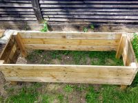
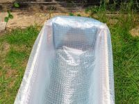
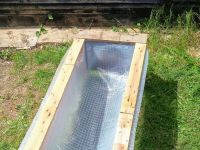

[][home]

Lockdown DIY Project #1
=======================

Updated: **17 May 2020**

I had a couple of pallets in the garden that I had dissembled for fire wood. Some of the pieces look to good just to burn, so I decided to build a garden planter with them.

Now I have to make some more.

------

<ul id="myNavbar" class="columns"></ul>

------

&copy; 2021 [Simon Arthur][home].  All rights reserved. | [Legal Stuff][legal]

[home]: <https://www.simonarthur.co.uk/> "Keep It Simple, Simon"
[legal]: <https://www.simonarthur.co.uk/legal.html> "Legal Stuff"