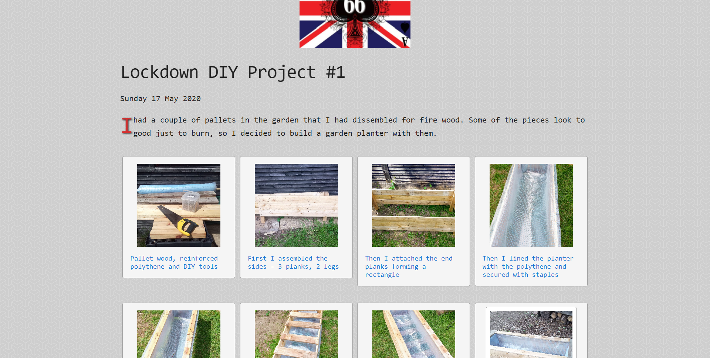
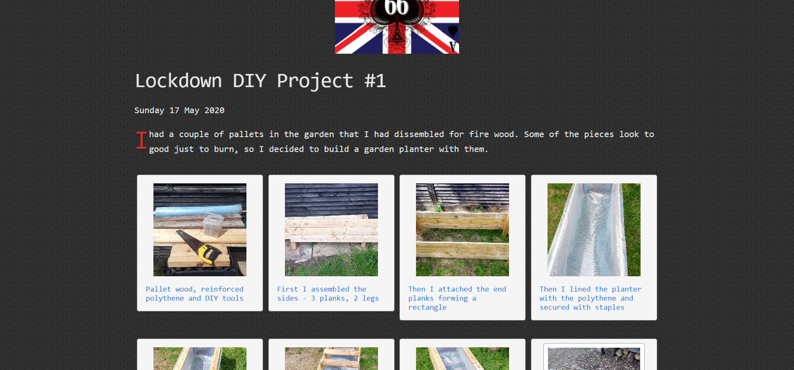

[][home]

Join the Dark Side
==================

Updated: 11 July 2020

Dark themes are becoming more popular. On some devices, they can even save battery power - somewhere between 15% and 60% if developed correctly. It all depends on what type of display your devices have — only devices with OLED displays can benefit from the power-saving, but these screens are becoming more common on mobile devices.

Dark themes are also moving on to the desktop devices. Most modern browsers now support a dark theme option and even Windows 10 will support dark themes as standard.

I decided to tone down the contrast and try a dark theme. Try changing your browser now to see how this site will look. I found this article and used their 'Dark Mode at the Operating System Level' method.

------

<ul id="myNavbar" class="columns"></ul>

------

&copy; 2021 [Simon Arthur][home].  All rights reserved. | [Legal Stuff][legal]

[home]: <https://www.simonarthur.co.uk/> "Keep It Simple, Simon"
[legal]: <https://www.simonarthur.co.uk/legal.html> "Legal Stuff"